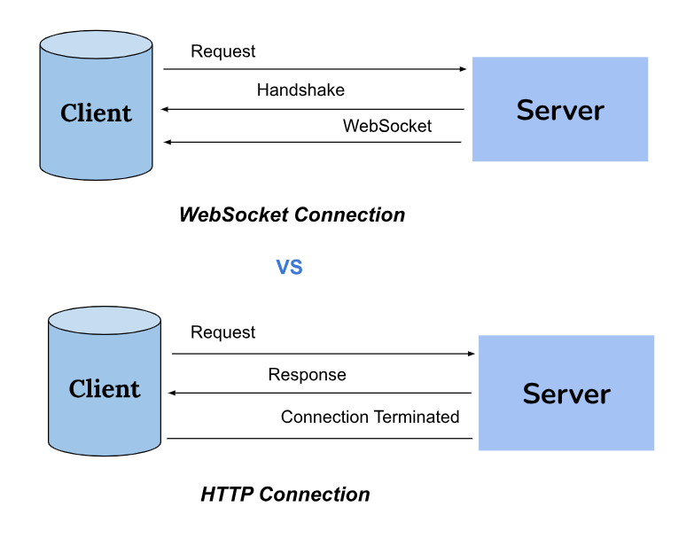
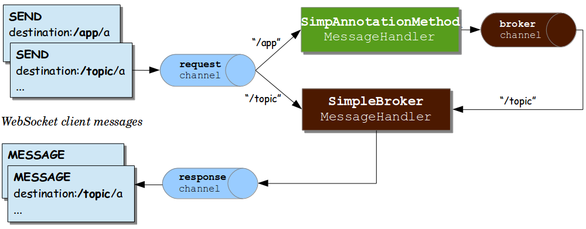

# Spring Boot 3 WebSocket

## Введение

WebSocket — это сетевой протокол, который позволяет устанавливать постоянное двустороннее соединение между клиентом (
например, браузером) и сервером через один TCP-канал.

В отличие от HTTP, где каждый запрос клиент должен инициировать заново, WebSocket даёт возможность:

* клиенту и серверу отправлять сообщения в любой момент,
* работать в режиме **реального времени** без постоянных перезапросов.



### Как работает:

1. Клиент сначала делает обычный HTTP-запрос с заголовком Upgrade: websocket.
2. Сервер принимает и переводит соединение из HTTP в WebSocket.
3. После этого соединение остаётся открытым, и стороны могут обмениваться сообщениями до тех пор, пока одно из них не
   закроет его.

## STOMP

STOMP (Simple Text Oriented Messaging Protocol) — это простой текстовый протокол обмена сообщениями, который часто
используется поверх WebSocket для организации работы с сообщениями.

Иными словами, STOMP — это протокол сообщений, построенный поверх WebSocket. Он облегчает обмен сообщениями, а также
позволяет дополнительно управлять сессией



### Основная идея:

WebSocket сам по себе — это просто «труба» для передачи данных. Но у него нет встроенного формата сообщений,
маршрутизации или подписок. Здесь на помощь приходит STOMP, который добавляет:

* формат сообщений (заголовки, тело),
* поддержку подписок (`SUBSCRIBE`) и отправки сообщений (`SEND`),
* управление соединением (`CONNECT`, `DISCONNECT`),
* подтверждение доставки (`ACK`, `NACK`).

### Как работает:

1. Клиент подключается к серверу через WebSocket.
2. Поверх WebSocket клиент и сервер начинают говорить на языке STOMP.
3. Клиент может:
   * отправлять сообщения в определённый «дестинейшн» (например, /app/chat),
   * подписываться на определённые топики (например, /topic/messages),
   * получать сообщения от других.

```nginx
SEND
destination:/topic/chat
content-type:text/plain

Привет всем!
^@
```

### Где используется STOMP:

* Spring WebSocket (в Spring Boot очень часто WebSocket интегрируется именно через STOMP),
* системы чатов, уведомлений,
* любые приложения, где нужен брокер сообщений поверх WebSocket.